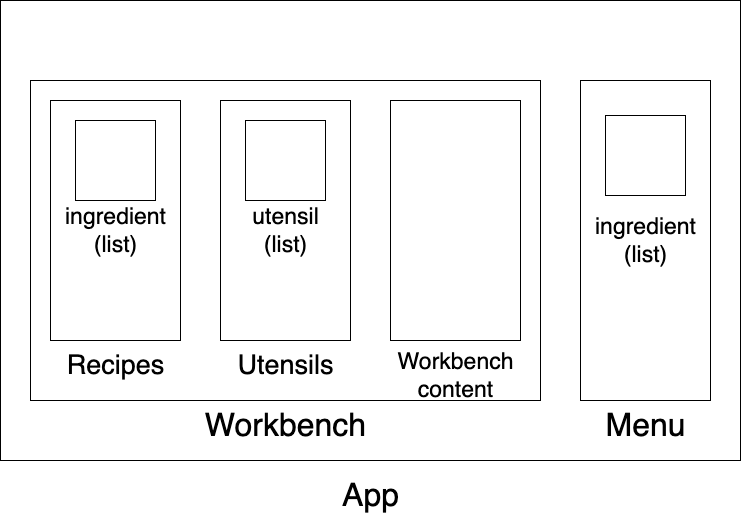

# Ejercicio integrador de la materia

El ejercicio integrador consiste en una aplicación web implementada con TypeScript y fundamentalmente el paquete, React. 

Para ejecutar la aplicación se debe, en primer lugar, instalar los paquetes necesarios mediante: `npm install`

Una vez instalado los paquetes, se puede iniciar la aplicación mediante `npm start` y se puede ejecutar en un navegador web, en el puerto 3000 del local host.

## Descripción de la aplicación

Se desarrolló un juego en el cual el objetivo es encontrar todas las **recetas** de un restaurant mediante la combinación de **ingredients** y **utensillos**. 

A partir de ingredientes básicos que se encuentran disponibles desde el inicio del juego se encuentran ingredientes más elaborados cuando se combinan con los utensillos. Algunos de los descubrimientos constituyen parte del menú del restaurant.

Una vez que se encuentran todos las recetas del menú se da por ganado el juego.

## Compontenes y Estructura básica

El componente principal de la aplicación, `App.tsx`, está compuesto esencialmente por dos componentes: la estación de trabajo `Workbench.tsx` y el menú `Menu.tsx`. 

La estación de trabajo `Workbench.tsx` contiene los elementos principales: `Recipes.tsx` y `Utensils.tsx`, los cuales contienen las lista de ingredientes y utensillos, respectivamente, y la estación de trabajo, propiamente dicha, donde interactúan los ingredientes y los utensillos.

A su vez, `Recipes.tsx` contiene una lista de los ingredientes disponibles, cuyo componente respectivo es `Ingredient.tsx`, y `Utensils.tsx` contiene una lista de los utensillos disponibles, cuyo componente respectivo es `Utensil.tsx`. 

Por otro lado, `Menu.tsx` contiene una lista de las recetas **descubiertas** que forman parte del menú, es decir, también, una lista de `Ingredient.tsx`.

A continuación se muestra una figura con el modelo de la aplicación para sumarizar la explicación.

